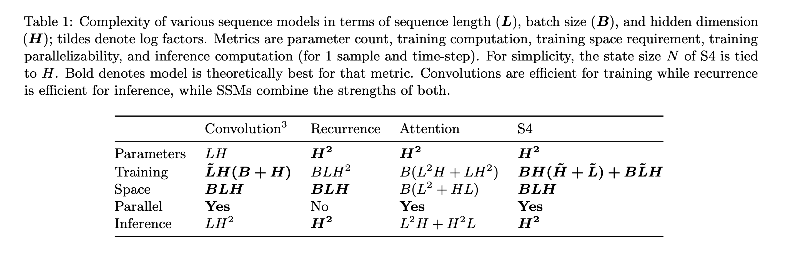

# Efficiently Modeling Long Sequences with Structured State Spaces

## Introduction

[Structure State Space(S4)](https://arxiv.org/pdf/2111.00396.pdf) Model is a new class of models that are based on the control theory: State space models). 

```
x'(t) = Ax(t) + Bu(t)
y(t)  = Cx(t) + Du(t)
```

In this replication project, we are treating this state space model as established, and focused on 
*how can we  leverage deep neural networks to efficiently parameterize three matrices A,B,C*.

**Why S4 is good at long sequence modeling?**

In the paper, they have mentioned a couple of times:
```
S4 can remember all the history. 
```
In our understanding, specifically, we think S4 was able to use 
encode the every time stamp into a hidden state that is of 500 dimensions. 

S4 has two different views: recurrent one, and convolution one. In the training time,
S4 efficiently trained and parameterized through a CNN model, 
but in the inference time, S4 can switch a RNN mode since learned parameters are shared. Hence in the inference time,
we can use the hidden state that is of 500 dimensions to reconstruct the entire sequence before time step t. 

The below is a comparison of the complexity from different models adapted from the original paper:




## JAX Version Setup
### Disclaim
We leverage the codes bases from [The Annotated S4](https://srush.github.io/annotated-s4/), and then make it work for our tasks. 

### Dataset downloading
For the dataset listops, which is part of 
Long Range Arena (LRA), which can be downloaded through their link [GitHub page](https://github.com/google-research/long-range-arena). 
Unzip the downloaded dataset, and move it to ```data``` folder. 
For IMDB review dataset, we used the huggingface one directly. 

### Requirements
We have slightly update the requirements, please go to requirements-cpu.txt and requirements-gpu to install dependencies. 

### WanDB setup
Change the WanDB project, and entity in the ```train.py``` file if you would like to see the visualizations. 

### Experiment run
```
python3.7 -m s4.train --dataset listops-classification --model s4 --epochs 50 --bsz 50 --d_model 64 --ssm_n 64 --lr 1e-2 --lr_schedule
python3.7 -m s4.train --dataset cifar-classification --model s4 --epochs 100 --bsz 100 --d_model 128 --ssm_n 64 --lr 1e-2 --lr_schedule
```


## Torch Version Setup
### Disclaim
We leverage the codes bases from [S4](https://github.com/HazyResearch/state-spaces), and then make it work for our tasks. 

### Dataset downloading
Similar to the above dataset downloading and processing. 

### Wandb Setup
First create [WanDB](https://wandb.ai/site) account, and obtain the API Key. Go to the configuration folder ```state-spaces/config```, and find the configuration file
for Wandb, and change the entity to yours. 

### Multi-GPU training
change the ```trainer.gpus``` parameters in your script. 

### Cauchy Kernel Adaption
We observed that sometimes, the package dependency KeOPS might not work. 
And the Cauchy Kernel fast implementation environment cannot be setup, hence please do the following:

- Go to  state-spaces-main/src/models/functional/cauchy.py
- change the function ```def cauchy_conj(v, z, w)``` to ```def cauchy_conj_slow(v, z, w)```

It might be slower, but this is the only way that we think would work if both Keops and fast kernal setup fail. 

### Experiment run
```
python -m train wandb=null experiment=s4-lra-listops
python -m train wandb=null experiment=s4-lra-imdb
```
To change the normalization, please go to ```state-spaces/config``` to choose the normalization approach that you prefer. 

## Replication Tasks

### ListOps

### IMDB Review Classification

## S4 Implementation

### S4 architecture

### 

## Experimental Results
Basically, we focused on comparing result implemented in JAX version with the original reported one. However, we found that it was not easy to re-produce the result even though 
we first used the exact same parameters (except the number of GPUs) as illustrated in the original paper and its released codebases.

Later we found that the **normalization approach** that you have chosen will directly influence reported results substantially. Hence we compare across four different models:

- S4-JAX: the one that we used Sasha's codesbases to implement, which chose basically *layer normalization*. 
- S4-Torch-LN: the one that we adapted based on Albert Gu's original codebases and used the *layer normalization* too. 
- S4-Torch-LN: the one that we adapted based on Albert Gu's original codebases and used the *batch normalization* too. 
- S4-reported: direct results reported in the original paper Tale 4. 


### ListOps
| Models   | Train Accuracy | Test Accuracy     |
| :---        |    :----:   |          ---: |
| S4-JAX      |        |    |
| S4-Torch-LN  |         |     |
| S4-Torch-BN  |          |      |
| S4 Reported |         |       |

### IMDB Review Classification
| Models   | Train Accuracy | Test Accuracy     |
| :---        |    :----:   |          ---: |
| S4-JAX      |        |    |
| S4-Torch-LN  |         |     |
| S4-Torch-BN  |          |      |
| S4 Reported |         |       |

## Conclusion
